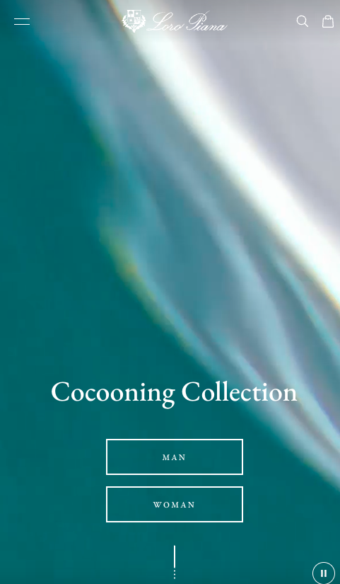

# Procesverslag
Markdown is een simpele manier om HTML te schrijven.  
Markdown cheat cheet: [Hulp bij het schrijven van Markdown](https://github.com/adam-p/markdown-here/wiki/Markdown-Cheatsheet).

Nb. De standaardstructuur en de spartaanse opmaak van de README.md zijn helemaal prima. Het gaat om de inhoud van je procesverslag. Besteedt de tijd voor pracht en praal aan je website.

Nb. Door *open* toe te voegen aan een *details* element kun je deze standaard open zetten. Fijn om dat steeds voor de relevante stuk(ken) te doen.

## Jij

  
uitwerken voor kick-off werkgroep

  ### Auteur:
  Luc Jordaan

  #### Je startniveau:
  blauw

  #### Je focus:
  Responsive
 

## Je website

  
uitwerken voor kick-off werkgroep

  ### Je opdracht:
  https://nl.loropiana.com/en/

  #### Screenshot(s) van de eerste pagina (small screen): 
  homepage 
  

  #### Screenshot(s) van de tweede pagina (small screen):
  fall winter collection men  
  
 

## Toegankelijkheidstest 1/2 (week 1)

  
uitwerken na test in 2e werkgroep

  ### Bevindingen
  Lijst met je bevindingen die in de test naar voren kwamen:

  Ik was in week 2 nog totaal niet ver met mijn eigen website. Ik was in de lessen voornamelijk bezig met de opdrachten, en dus niet met mijn website. Dit had als gevolg dat ik eigenlijk alleen een header had zonder vormgeving.

## Breakdownschets (week 1)

  
uitwerken na afloop 3e werkgroep

  ### de hele pagina: 
  

  ### dynamisch deel (bijv menu): 
  

  ### wellicht nog een dynamisch deel (bijv filter): 
  

## Voortgang 1 (week 2)

  
uitwerken voor 1e voortgang

  ### Stand van zaken
  hier dit ging goed & dit was lastig (neem ook screenshots op van delen van je website en code)

  

  -Ik heb heel lang zitten kloten met een hamburger menu en uiteindelijk is het soort van gelukt, maar ik ben er niet helemaal blij mee.

  ### Agenda voor meeting
  samen met je groepje opstellen

  | student 1      | student 2          | student 3    | student 4        |
  | ---            | ---                | ---          | ---              |
  | dit bespreken  | en dit             | en ik dit    | en dan ik dat    |
  | en dat ook nog | dit als er tijd is | nog een punt | dit wil ik zeker |
  | ...            | ...                | ...          | ...              |

  ### Verslag van meeting
  hier na afloop snel de uitkomsten van de meeting vastleggen

  - punt 1: Ik moet mijn header echt afmaken
  - punt 2: Ik moet eerst even de basis elementen in HTML zetten voordat ik teveel aan mijn vormgeving zit.
  - nog een punt: Mijn background image werkte niet mee.
  - ...

## Voortgang 2 (week 3)

  
uitwerken voor 2e voortgang

  ### Stand van zaken
  hier dit ging goed & dit was lastig (neem ook screenshots op van delen van je website en code)

  

  -Dit is een element van mijn tweede pagina die lastig leek, en die ik wil proberen.

  ### Agenda voor meeting
  samen met je groepje opstellen

  | student 1      | student 2          | student 3    | student 4        |
  | ---            | ---                | ---          | ---              |
  | dit bespreken  | en dit             | en ik dit    | en dan ik dat    |
  | en dat ook nog | dit als er tijd is | nog een punt | dit wil ik zeker |
  | ...            | ...                | ...          | ...              |

  ### Verslag van meeting
  hier na afloop snel de uitkomsten van de meeting vastleggen

  - punt 1: Ik heb de basis elementen in HTML en moet nu gaan beginnen aan de vormgeving
  - punt 2: De vormgeving is moeilijker dan ik dacht, en ik ben al heel veel tijd kwijt daaraan.
  - nog een punt
- ...

## Toegankelijkheidstest 2/2 (week 4)

  
uitwerken na test in 9e werkgroep

  ### Bevindingen
  Lijst met je bevindingen die in de test naar voren kwamen (geef ook aan wat er verbeterd is):

  -Veel van mijn elementen had ik niet in een echte link gemaakt, maar meer gebruikt als filler. Hierdoor werkte de screenreader niet helemaal.
  -Verder werkte het navigeren door de site prima.

## Voortgang 3 (week 4)

  
uitwerken voor 3e voortgang

  ### Stand van zaken
  hier dit ging goed & dit was lastig (neem ook screenshots op van delen van je website en code)

  
  

  -ik had wat problemen met dit gedeelte en het lukte mij niet om het zelf op te lossen. Dus ik ben zo ver gekomen als mij zonder hulp gaat lukken, en de rest laat ik helaas voor wat het is. De vormgeving is uiteindelijk niet het belangrijkste.

  ### Agenda voor meeting
  samen met je groepje opstellen

  | student 1      | student 2          | student 3    | student 4        |
  | ---            | ---                | ---          | ---              |
  | dit bespreken  | en dit             | en ik dit    | en dan ik dat    |
  | en dat ook nog | dit als er tijd is | nog een punt | dit wil ik zeker |
  | ...            | ...                | ...          | ...              |

  ### Verslag van meeting
  hier na afloop snel de uitkomsten van de meeting vastleggen

  - punt 1: Ik moet mijn hamburger menu nog fixen.
  - punt 2: Ook moet ik nog bepaalde dingen responsive maken zoals de nav en de section van de tennis schoenen..
  - nog een punt
  - ...

## Eindgesprek (week 5)

  
uitwerken voor eindgesprek

  ### Je uitkomst - karakteristiek screenshots:
  

  -In het algemeen ben ik best blij met hoe mijn eigen website is geworden. Het heeft zeker het gevoel van de Loro Piana website. Er zijn bepaalde dingen die ik nog zou willen verbeteren maar daar had ik extra hulp bij nodig.

  ### Dit ging goed/Heb ik geleerd: 
  Korte omschrijving met plaatjes

  

  -Ik heb veel geleerd over grids gebruiken en hoe ik een website responsive moet. En ik ben vooral trots op deze elementen.

  ### Dit was lastig/Is niet gelukt:
  Korte omschrijving met plaatjes

  

-Wat minder goed ging was deze section met de tennis schoenen. Het was een ingewikkelde grid en het lukte mij niet om het te laten lijken op de website. Ook lukte het mij niet om de nav helemaal te maken zoals in de echte site, want het veranderde de responsivness van de site.

## Bronnenlijst

  
continu bijhouden terwijl je werkt

  Nb. Wees specifiek ('css-tricks' als bron is bijv. niet specifiek genoeg). 
  Nb. ChatGpT en andere AI horen er ook bij.
  Nb. Vermeld de bronnen ook in je code.

  1. bron 1: https://css-tricks.com/css-only-carousel/
  2. bron 2: https://www.w3schools.com/cssref/css3_pr_mediaquery.php
  3. bron 3: https://www.w3schools.com/css/css_grid.asp
  4. bron 4: chrome-extension://efaidnbmnnnibpcajpcglclefindmkaj/https://dlo.mijnhva.nl/content/enforced/536487-FDMCI-2000FED121-DMCI-CMD-2324/FED%2023-24%20-%20Blok%201%20-%20Oefening%20flexbox.pdf
  5. bron 5: https://developer.mozilla.org/en-US/docs/Web/CSS/object-fit?retiredLocale=nl

